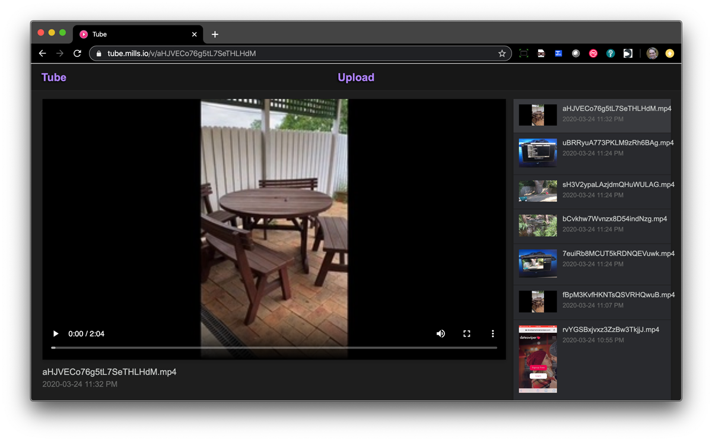

<!--
Ohart ongi: README hau automatikoki sortu da <https://github.com/YunoHost/apps/tree/master/tools/readme_generator>ri esker
EZ editatu eskuz.
-->

# Tube YunoHost-erako

[](https://dash.yunohost.org/appci/app/tube)  

[](https://install-app.yunohost.org/?app=tube)

*[Irakurri README hau beste hizkuntzatan.](./ALL_README.md)*

> *Pakete honek Tube YunoHost zerbitzari batean azkar eta zailtasunik gabe instalatzea ahalbidetzen dizu.*  
> *YunoHost ez baduzu, kontsultatu [gida](https://yunohost.org/install) nola instalatu ikasteko.*

## Aurreikuspena

Tube is a Youtube-like (without censorship and features you don't need!) Video Sharing App written in Go which also supports automatic transcoding to MP4 H.265 AAC, multiple collections and RSS feed.

### Features

- Easy to add videos (just move a file into the folder)
- Easy to upload videos (just use the builtin uploader and automatic transcoder!)
- Builtin ffmpeg-based Transcoder that automatically converts your uploaded content to MP4 H.264 / AAC
- Builtin automatic thumbnail generator
- No database (video info pulled from file metadata)
- No JavaScript (the player UI is entirely HTML, except for the uploader which degrades!)
- Easy to customize CSS and HTML template
- Automatically generates RSS feed (at /feed.xml)
- Clean, simple, familiar UI


**Paketatutako bertsioa:** 1.2.0~ynh3

**Demoa:** <https://tube.mills.io>

## Pantaila-argazkiak



## Dokumentazioa eta baliabideak

- Aplikazioaren webgune ofiziala: <https://tube.mills.io>
- Jatorrizko aplikazioaren kode-gordailua: <https://git.mills.io/prologic/tube>
- YunoHost Denda: <https://apps.yunohost.org/app/tube>
- Eman errore baten berri: <https://github.com/YunoHost-Apps/tube_ynh/issues>

## Garatzaileentzako informazioa

Bidali `pull request`a [`testing` abarrera](https://github.com/YunoHost-Apps/tube_ynh/tree/testing).

`testing` abarra probatzeko, ondorengoa egin:

```bash
sudo yunohost app install https://github.com/YunoHost-Apps/tube_ynh/tree/testing --debug
edo
sudo yunohost app upgrade tube -u https://github.com/YunoHost-Apps/tube_ynh/tree/testing --debug
```

**Informazio gehiago aplikazioaren paketatzeari buruz:** <https://yunohost.org/packaging_apps>
