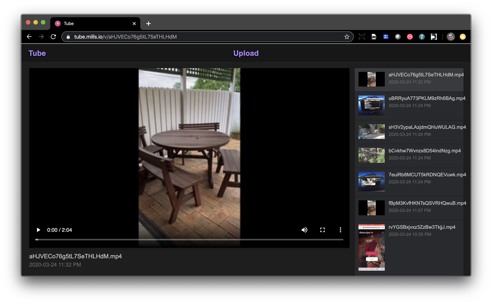

<!--
N.B.: This README was automatically generated by https://github.com/YunoHost/apps/tree/master/tools/README-generator
It shall NOT be edited by hand.
-->

# Tube pour YunoHost

[](https://dash.yunohost.org/appci/app/tube)    
[](https://install-app.yunohost.org/?app=tube)

*[Read this readme in english.](./README.md)*

> *Ce package vous permet d'installer Tube rapidement et simplement sur un serveur YunoHost.
Si vous n'avez pas YunoHost, regardez [ici](https://yunohost.org/#/install) pour savoir comment l'installer et en profiter.*

## Vue d'ensemble

tube is a Youtube-like (without censorship and features you don't need!) Video Sharing App written in Go which also supports automatic transcoding to MP4 H.265 AAC, multiple collections and RSS feed.

### Features

- Easy to add videos (just move a file into the folder)
- Easy to upload videos (just use the builtin uploader and automatic transcoder!)
- Builtin ffmpeg-based Transcoder that automatically converts your uploaded content to MP4 H.264 / AAC
- Builtin automatic thumbnail generator
- No database (video info pulled from file metadata)
- No JavaScript (the player UI is entirely HTML, except for the uploader which degrades!)
- Easy to customize CSS and HTML template
- Automatically generates RSS feed (at /feed.xml)
- Clean, simple, familiar UI


**Version incluse :** 1.1.13~ynh2

**Démo :** https://tube.mills.io

## Captures d'écran



## Avertissements / informations importantes

## Configuration

#### Where are stored your videos

Your video files are stored by default in `/home/yunohost.app/tube/videos`.

You can configure options in this file `/var/www/tube/config.json` using the [documentation](https://git.mills.io/prologic/tube#configuration). Remember to restart Tube service if you change your configuration file.

RSS feed address is available at `https://your_domain.tld/feed.xml`

## Documentations et ressources

* Dépôt de code officiel de l'app : <https://git.mills.io/prologic/tube>
* Documentation YunoHost pour cette app : <https://yunohost.org/app_tube>
* Signaler un bug : <https://github.com/YunoHost-Apps/tube_ynh/issues>

## Informations pour les développeurs

Merci de faire vos pull request sur la [branche testing](https://github.com/YunoHost-Apps/tube_ynh/tree/testing).

Pour essayer la branche testing, procédez comme suit.

``` bash
sudo yunohost app install https://github.com/YunoHost-Apps/tube_ynh/tree/testing --debug
ou
sudo yunohost app upgrade tube -u https://github.com/YunoHost-Apps/tube_ynh/tree/testing --debug
```

**Plus d'infos sur le packaging d'applications :** <https://yunohost.org/packaging_apps>
